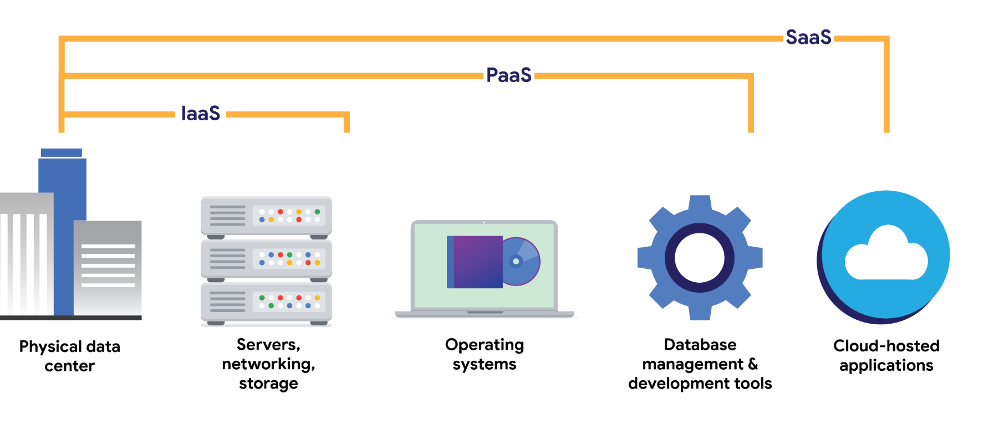

[Home](index.md) | [Projects](projects.md) |

# Cybersecurity learnings

## DAY 4 27/06/25 – SIEM 

### SIEM Tools & SOAR

- **SIEM (Security Information and Event Management)** tools log and analyze data from:
  - Firewall logs
  - Network logs
  - Server logs
- **Uses**: Create dashboards, monitor metrics (e.g., response time, failure rate)
- **SOAR (Security Orchestration, Automation and Response)**: Automates response using playbooks and workflows
- **Deployment Types**:
  - Self-hosted, cloud-hosted, hybrid
  - Tools: Splunk, Chronicle, Elastic
  - Open-source examples: Suricata, Linux tools
- **Playbooks**: Step-by-step manuals for incident response
  - **6 Phases**:
    1. Preparation  
    2. Detection and Analysis  
    3. Containment  
    4. Eradication and Recovery  
    5. Post-Incident Activity  
    6. Coordination  

### Networks

- A network is a group of connected devices communicating via MAC and IP addresses
- **LAN** – Local Area Network (small area)  
- **WAN** – Wide Area Network (large area)
- **Devices**:
  - **Hub** – Broadcasts to all devices
  - **Switch** – Sends to intended devices only
  - **Router** – Connects multiple networks
  - **Modem** – Connects network to the internet
- **Firewall** – Controls incoming/outgoing traffic
- **Simulation Tools**: Cisco Packet Tracer
- **Cloud Computing Models** (CSP):
  - **IaaS** – Infrastructure as a Service
  - **PaaS** – Platform as a Service
  - **SaaS** – Software as a Service

### Data Packets

- **Packet Structure**:
  - **Header** – IP, MAC, Protocol
  - **Body** – Message content
  - **Footer** – Signals end of packet
- **Bandwidth** – Amount of data received per second
- **Packet Sniffing** – Inspecting packets in transit

### TCP/IP Model

- **Purpose**: Organizes and transmits data across networks
- **4 Layers**:
  1. Application – HTTP, DNS, TLS  
  2. Transport – TCP, UDP  
  3. Internet – IP routing  
  4. Network Access – Hardware & data link
- **Common Ports**:
  - 25 – Email  
  - 443 – Secure web traffic  
  - 20 – Large file transfers

### OSI Model (7 Layers)

1. Application  
2. Presentation  
3. Session  
4. Transport  
5. Network  
6. Data Link  
7. Physical  

### IP Addressing & IPv4 Packet Header

- **IPv4 vs IPv6** – Can be public or private
- **Private IPs** – Used only within the same internal network

#### 13 Fields in IPv4 Header

1. **Version (VER)** – IP version used (e.g., IPv4)
2. **Header Length (IHL)** – Length of the header
3. **Type of Service (ToS)** – Quality of service indicator
4. **Total Length** – Length of header + data
5. **Identification** – Unique ID for packet reassembly
6. **Flags** – Fragmentation status
7. **Fragment Offset** – Position of this fragment
8. **Time to Live (TTL)** – Packet expiry to avoid endless looping
9. **Protocol** – Indicates transport protocol (TCP/UDP)
10. **Header Checksum** – Error detection
11. **Source IP Address** – Sender’s IP
12. **Destination IP Address** – Receiver’s IP
13. **Options** – Optional settings if header is extended

---

## DAY 3 25/06/25 - Risk Management, Audits, and Threats - Google Course

### Security Posture & Risk Management
- A strong **security posture** includes:
  - Clear security goals and objectives
  - Risk mitigation processes
  - Compliance with laws (e.g., GDPR, APRA CPS 234)
  - Business continuity plans
  - Ethical and legal security practices

- **Risk Management Steps (NIST RMF)**:
  1. **Prepare** – Understand org context, assets, and resources
  2. **Categorize** – Identify asset criticality and impact levels
  3. **Select** – Choose appropriate controls (e.g., from NIST 800-53)
  4. **Implement** – Deploy security controls across systems
  5. **Assess** – Evaluate control effectiveness
  6. **Authorize** – Approve system operations based on risk
  7. **Monitor** – Continuously track security and risks

- Common **organizational risks**:
  - Misconfigurations
  - Unpatched software
  - Shadow IT
  - Weak access controls

### Audits & Vulnerability Management

- **Security Audit** = structured evaluation of controls, policies, and procedures.
  - Can be internal or external
  - Checks compliance against standards (e.g., ISO 27001, NIST, SOC 2)
  - Assesses whether controls are sufficient to protect critical assets

- **Internal Audit Steps**:
  1. Define scope and goals
  2. Risk assessment of critical assets
  3. Evaluate control implementation
  4. Identify gaps and compliance issues
  5. Report findings and improvement plans

### Real-World Vulnerabilities (Examples)

| Vulnerability | Impact |
|---------------|--------|
| **ProxyLogon** | Exploits Microsoft Exchange (pre-auth RCE) |
| **ZeroLogon** | Bypass Netlogon authentication (domain takeover) |
| **Log4Shell** | RCE in Log4j logging framework |
| **PetitPotam** | Forces NTLM authentication to hijack sessions |
| **SSRF** | Tricks server to access unintended backend services |
| **Security Logging Failures** | Enables undetected attacks due to poor log monitoring |

### OWASP Security Principles (Expanded)
These support secure design and development:
- **Minimize attack surface**
- **Principle of least privilege**
- **Defense in depth**
- **Fail securely** – systems fail in a way that maintains security
- **Fix issues correctly** – apply root cause fixes, not patches
- **Keep security simple** – avoid overly complex controls
- **Separation of duties** – no one person has total control
- **Avoid security through obscurity**
- **Don’t trust external services by default**

### Threats, Risks & Impacts

| Term | Definition |
|------|------------|
| **Threat** | A potential cause of harm (e.g., hacker, malware) |
| **Vulnerability** | Weakness that can be exploited (e.g., unpatched system) |
| **Risk** | Probability + impact of a threat exploiting a vulnerability |

**Examples of threats:**
- **Ransomware** – Locks data and systems, demands payment
- **Phishing** – Deceives users to gain sensitive info
- **Insider threats** – Malicious or negligent employees

**Impacts of security incidents:**
- Financial losses (e.g., ransomware payouts, breach costs)
- Reputational damage
- Identity theft
- Legal or regulatory fines

### Web Layers Overview
- **Surface Web**: Indexed, public (Google, Wikipedia)
- **Deep Web**: Hidden behind logins (bank portals, intranets)
- **Dark Web**: Encrypted networks (accessed via Tor), anonymous traffic

### Reflections / What I Learned
- Understanding **audit frameworks** and **risk frameworks** helps align cybersecurity with business.
- Real-world vulnerabilities (e.g., Log4Shell) show why regular patching and monitoring is vital.
- Strong **foundational principles (OWASP)** are essential even in modern cloud-based environments.

---

## DAY 2 24/06/25 - Foundations of Cybersecurity - Google Course
https://grow.google/certificates/en_au/certificates/cybersecurity/?utm_source=google&utm_medium=paidsearch&utm_campaign=ha-sem-bk-cs-exa-mid__geo%E2%80%94AU&utm_term=google%20cyber%20security%20certification&utm_content=RSA1&gwg_campaign_id=22282035594&gad_source=1&gad_campaignid=22282035594&gbraid=0AAAAApjPcOJM3Co18Strlt1tJm4d3un93&gclid=CjwKCAjwmenCBhA4EiwAtVjzmkMLWYodkW0CQBJ2ChK6SZgBmwAYeVMAhq0yoBkHw6_tOf9b-cO6_BoCozEQAvD_BwE&gclsrc=aw.ds
### Foundations of Cybersecurity – Key Learnings  
#### Security Domains Overview

##### 1. Security and Risk Management
- Update and enforce company security policies
- Align practices with legal, regulatory, and business requirements

##### 2. Asset Security
- Classify and handle data appropriately
- Ensure proper disposal and destruction of hardware and sensitive materials

##### 3. Security Architecture and Engineering
- Design and implement secure systems
- Configure firewalls and security infrastructure

##### 4. Communication and Network Security
- Use secure network protocols (e.g., VPNs)
- Protect data in transit and ensure secure communication channels

##### 5. Identity and Access Management (IAM)
- Control who has access to what
- Validate user roles, permissions, and use of access devices (e.g., key cards)
- Secure authentication and authorization

##### 6. Security Assessment and Testing
- Conduct audits, risk assessments, and penetration testing
- Identify vulnerabilities before attackers do

##### 7. Security Operations
- Monitor and investigate security events
- Respond to incidents and perform forensics

##### 8. Software Development Security
- Secure coding practices and code reviews
- Integrate security throughout the development lifecycle (DevSecOps)

#### Security Frameworks and Principles

- Identify and analyze critical assets
- Implement structured guidelines to mitigate risk
- Manage the **Security Lifecycle**
- Protect:
  - **PII** (Personally Identifiable Information)
  - Financial and sensitive business data
- Comply with data laws (e.g., **GDPR**)
- Define and document security goals
- Apply **Security Controls** and enforce strong security processes
- Communicate risks and results effectively

#### Core Concepts:
- **CIA Triad**:
  - **Confidentiality**
  - **Integrity**
  - **Availability**
- **NIST Cybersecurity Framework (CSF)**:
  - Provides a baseline to manage both short- and long-term cybersecurity risks

#### Ethics in Cybersecurity

- Practice ethical behavior when handling data and systems
- Preserve evidence correctly with chain of custody protocols
- Follow legal standards and industry guidelines

#### Tools and Techniques

##### SIEM Tools (Security Information and Event Management)
- Collect and analyze real-time security data
- Generate alerts for anomalies
- Examples: **Elastic**, **Splunk**, **Google Chronicle**

##### Packet Sniffers
- Tools like `tcpdump` and **Wireshark** used to analyze network traffic

##### Incident Response Playbooks
- Define step-by-step actions for handling incidents
- Include:
  - **Order of volatility** (what to collect first)
  - Chain of custody
  - Evidence handling procedures

---

## DAY 1 19/06/25
### How the Internet Works – Beginner Notes
- Internet = network of wires and routers connecting devices worldwide  
- Servers have public IP addresses  
- Clients connect indirectly via Internet Service Providers (ISPs)  
- Data is split into packets for transmission  
- Packets contain pieces of the message  
- Packets are routed through multiple routers to reach destination  
- Each router adds its own IP info (like layers of envelopes)  
- Server unwraps packet layers to retrieve original message  
- Routers act as traffic directors for packets  
- Clients get temporary IPs assigned by ISP

Link: https://www.youtube.com/watch?v=7_LPdttKXPc

---

### OSI Model
The OSI (Open Systems Interconnection) Model defines how data is transferred through a network. It consists of 7 layers, each responsible for a specific aspect of communication. Each layer uses a package of protocols.
The 7 Layers of the OSI Model (Top to Bottom):
Application Layer

The **OSI (Open Systems Interconnection)** Model defines how data is transferred through a network. It consists of **7 layers**, each responsible for a specific aspect of communication. Each layer uses a package of protocols.

#### The 7 Layers of the OSI Model (Top to Bottom):

##### 1. Application Layer
- Used by network applications (e.g., web browsers, email clients).
- **Protocols**: `HTTP`, `HTTPS`, `FTP`, `SMTP`, `Telnet`, etc.
- Handles services like file transfer, web browsing, emails, and virtual terminals.

##### 2. Presentation Layer
- Converts data from application formats (e.g., text, numbers) into binary (e.g., ASCII to EBCDIC).
- Handles **data compression** (lossy/lossless).
- Handles **encryption/decryption** using protocols like **SSL (Secure Sockets Layer)**.
- Ensures data integrity and compatibility between systems.

##### 3. Session Layer
- Establishes, manages, and terminates sessions between devices.
- Handles **authentication** before a session starts.
- Tracks session activity (e.g., which packets belong to which file).
- **Protocols/APIs**: `NetBIOS`, `APIs` (Application Programming Interfaces).

##### 4. Transport Layer
- Ensures **reliable data transfer** via segmentation, flow control, and error control.
- **Segmentation**: Splits data into segments with port and sequence numbers.
- **Flow Control**: Manages the rate of data transmission.
- **Error Control**: Uses **ARQ (Automatic Repeat Request)** and checksums.
- **Protocols**: `TCP` (reliable, connection-based), `UDP` (fast, connectionless – e.g., streaming).

##### 5. Network Layer
- Handles **logical addressing**, **routing**, and **path determination**.
- Assigns sender and receiver **IP addresses**.
- **Routing Protocols**: `OSPF`, `BGP`, `IS-IS`.

##### 6. Data Link Layer
- Responsible for **physical addressing** using **MAC addresses** (12-digit alphanumeric hardware address).
- Packages data into **frames**.
- Controls access to the physical medium (e.g., LAN cables, fiber optics, wireless).
- **Protocols**: `CSMA` (Carrier Sense Multiple Access), `MAC` for media access and error detection.

##### 7. Physical Layer
- Converts binary data into **physical signals** (electrical, light, or radio signals).
- Handles hardware connections (e.g., cables, switches, signal voltage).
- Defines transmission media and bit transmission methods.

> 💡 **Mnemonic to remember the OSI layers (top-down):**  
**All People Seem To Need Data Processing**  
(Application, Presentation, Session, Transport, Network, Data Link, Physical)

Link: https://www.youtube.com/watch?v=vv4y_uOneC0

---
